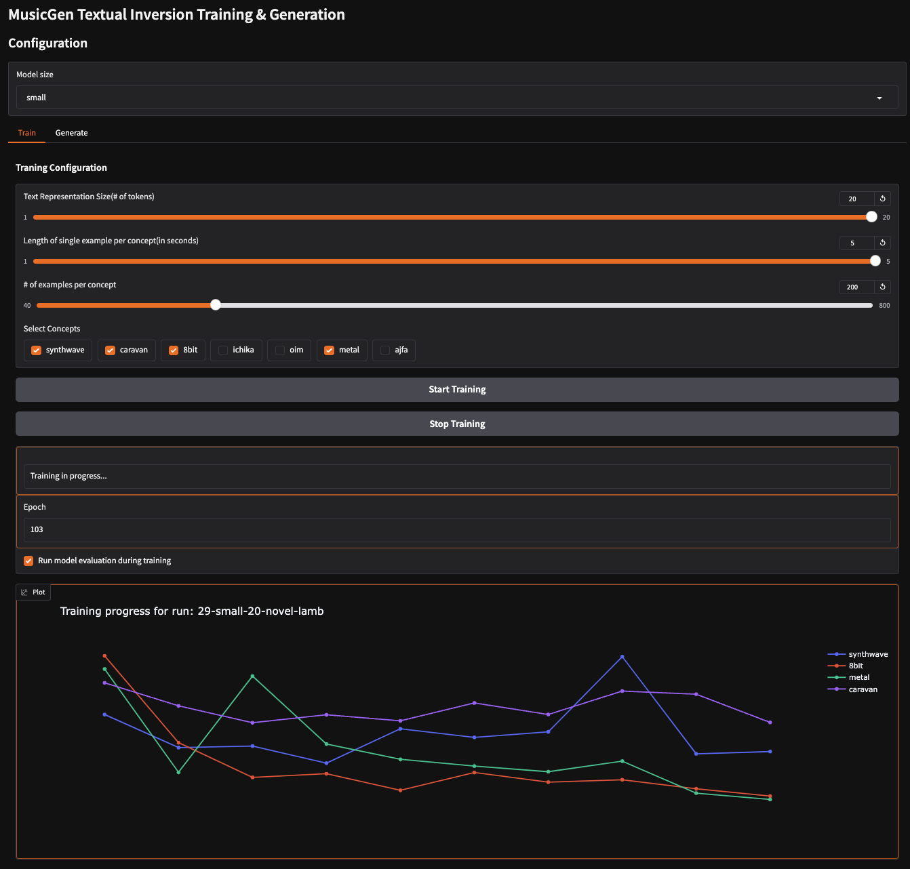
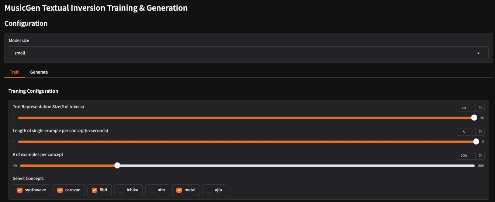
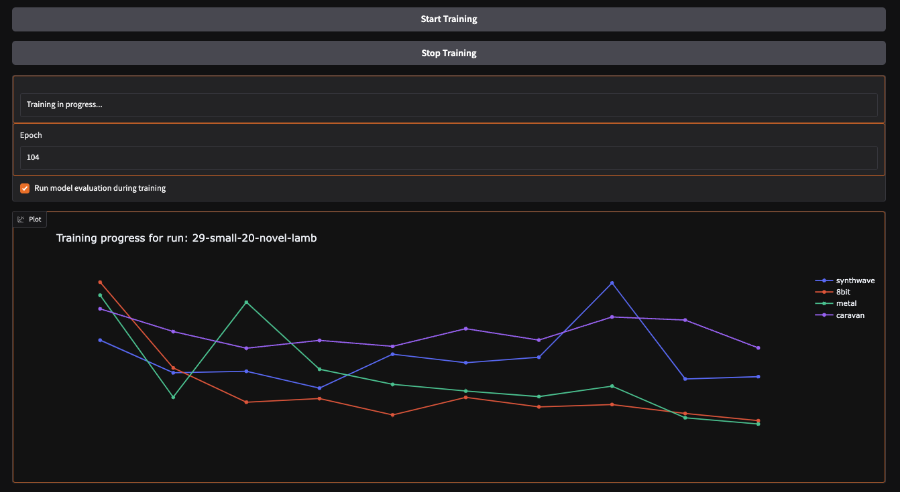
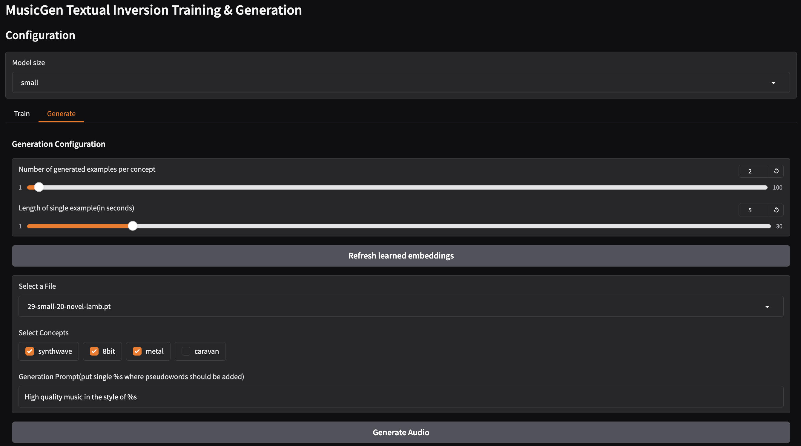
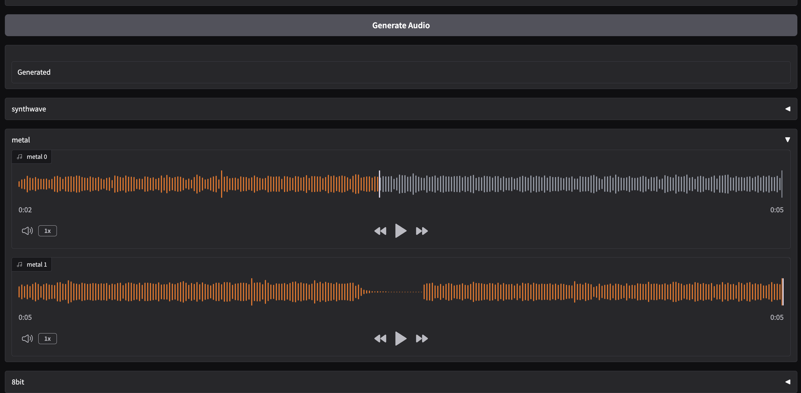

conditioning-of-musical-generative-models
==============================

This is the repository for Mikołaj Szawerda's engineering thesis. Here, I experimented with conditioning
music-generating models. I primarily focused on the text-to-music model MusicGen and adapted textual inversion for
it—adding audio conditioning. The repository contains the code necessary to run the experiments and an application that
allows for easy execution of inversion on a custom dataset.

---

Required to initialize project:

- `python3`(3.9;3.10), `pipx`, `just`, `poetry`, `ffmpeg`
- `wandb api key` if you want to run trainig
- filling `.env` file
- graphic card with min. 12 gb vram(to run small model)

Clone repo:

```shell
git clone --recurse-submodules -j8 git@github.com:MikolajSzawerda/musical-generative-models-conditioning.git
```

Available tools:

```shell
just -l
```

### Repository structure

---------------------------------

    ├── data
    │   ├── input         <- data to digest by models
    │   ├── output        <- data retrieved from models
    │   └── raw           <- data to be processed
    ├── docs                    <- text files with knowledge handy to have in repo
    │   └── autoresearch  <- papers autmaticaly scraped
    ├── logs                    <- logs from trainings
    ├── configs                 <- yaml configs for training
    ├── models                  <- saved artefacts after succesfull training
    ├── visualization           <- aggregated results from experiments in the form of notebooks
    ├── scripts                 <- handy shell scripts
    ├── src                     <- experiments/tooling
    │   ├── app           <- gradio app to have fun with textual inversion
    │   ├── audiocraft    <- experiments with music gen
    │   ├── paper-query   <- auto arxiv scraper
    │   └── tools         <- tools for easier life in the project

---------------------------------

### Running application

To speed up training application requires dataset in specific structure and content(audio already encoded etc).
To run application on your custom dataset please prepare directory with structure

---------------------------------

    ├── root directory
    │   ├── <concept-name>  <- names of subdirectories represent concept name
    │   │  ├── <audio-file.wav/.mp3>    <- reference audio files
    │   │  ├── <music_2.wav>     
    │   │  └── ...              
    │   ├── 8bit    <- example subdirectory aka concept name
    │   │  ├── music_1.wav  <- example reference audio
    │   │  ├── music_2.wav    
    │   │  └── ...              
    │   └── ...
    │   │  └── ...              

---------------------------------

Run audio dataset preprocessing:

```shell
just prepare-app-dataset <provide-dataset-name> <provide-audio-dataset-path>
```

- dataset-name: script will create dirs in `data/input/<dataset-name>`
- audio-dataset: script will traverse `<audio-dataset/<concept-name>/*.wav` and create dataset of required structure

Preprocessor will:

- split audio files into 5 sec fragments(using ffmpeg)
- encode it using EnCodec(so gpu is more than welcome)
- create metadata_train.json file that will contain paths etc

```shell
just prepare-app
just run-app <provide-dataset-path> <provide-embed-path>
```

- dataset-path: path to preprocessed dataset
- embed-dataset: path to directory where application should store embedings during training ex. `models/<dataset-name>`

---

You can ask author of this repo to provide you example-dataset, and then just run:

```shell
just download-example-dataset
just prepare-app
just run-app data/input/example-dataset models/example-dataset
```

### Running sweep training

In configs there are defined wandb sweeps used for experiments. They require dataset in preprocessed form(you can ask me
for originall dataset or just create your own and just change concepts names in them)

```shell
export WANDB_API_KEY=<provide_key>
just run-sweep-training <dataset-name> <sweep-config-path>
```

- dataset-name: use dataset from `data/input/<dataset-name>`
- wandb sweep config yaml, examples in `configs/*.yaml`

So for example dataset:

```shell
export WANDB_API_KEY=<provide_key>
just run-sweep-training example-dataset configs/sweep_config.yaml
```

### Running single training

```shell
just training-args #run to get hyperparameters
just run-training <dataset-name> --<arg_1> val_1 ...
```

So for example dataset:

```shell
just run-training example-dataset --model-name large --concepts 8bit synthwave --tokens-num 10
```

### App instructions

**Application interface**:



**Training arguments**:



- concept names are fetched from provided dataset subdirectories

**Training**: Training is run after clicking start training. Each button click spawns new model and run training on it
with provided arguments. Additionaly during training after each epoch in `embeds_dir` is saved file with learned text
representation.

During training (with monitoring turned on) you can observe that after every 10 epoch evaluation is run, that
calculates $FAD_{CLAP}$ with respect to provided dataset and generated examples(this takes some time...)

Clicking Stop Training will remove model



**Generation arguments:**

You need to choose from UI learned embedings from `embeds_dir`. When content of dir changes you can rescan it with
`Refresh learned embeddings`



**Generated examples:**




